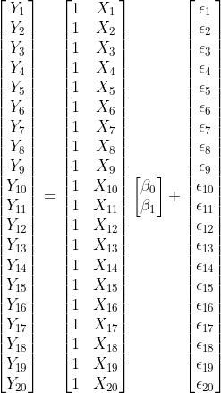
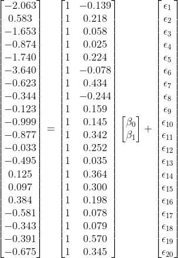

<style>

.blockquote {
  border-left: 5px solid #007935;
  background: #f9f9f9;
  padding: 10px;
  padding-left: 30px;
  margin-left: 16px;
  margin-right: 0;
  border-radius: 0px 4px 4px 0px;
}

#infobox {
  padding: 1em 1em 1em 4em;
  margin-bottom: 10px;
  border: 2px solid black;
  border-radius: 10px;
  background: #E6F6DC 5px center/3em no-repeat;
}

.centering[
  float: center;
]

.left-column2 {
  width: 50%;
  height: 92%;
  float: left;
  padding-top: 1em;
}

.right-column2 {
  width: 50%;
  float: right;
  padding-top: 1em;
}

.remark-code {
  font-size: 18px;
}

.tiny .remark-code { /*Change made here*/
  font-size: 60% !important;
}

.tiny2 .remark-code { /*Change made here*/
  font-size: 50% !important;
}

.indent {
  margin-left: 3em;
}

.single {
  line-height: 1 ;
}


.double {
  line-height: 2 ;
}

.title-slide h1 {
  padding-top: 0px;
  font-size: 40px;
  text-align: center;
  padding-bottom: 18px;
  margin-bottom: 18px;
}

.title-slide h2 {
  font-size: 30px;
  text-align: center;
  padding-top: 0px;
  margin-top: 0px;
}

.title-slide h3 {
  font-size: 30px;
  color: #26272A;
  text-align: center;
  text-shadow: none;
  padding: 10px;
  margin: 10px;
  line-height: 1.2;
}

</style>

```{R, setup, include = F}
library(pacman)
p_load(here, tidyverse, ggplot2, xaringan, knitr, kableExtra, 
       xaringanthemer,DT,dplyr,gridExtra, plotly)

#i_am("B:/UO Teaching/EDUC614/Winter22/Slide Template/template.rmd")

red_pink <- "#e64173"
turquoise = "#20B2AA"
orange = "#FFA500"
red = "#fb6107"
blue = "#3b3b9a"
green = "#8bb174"
grey_light = "grey70"
grey_mid = "grey50"
grey_dark = "grey20"
purple = "#6A5ACD"
slate = "#314f4f"

extra_css <- list(
  ".red"   = list(color = "red"),
  ".blue"  =list(color = "blue"),
  ".red-pink" = list(color= "red_pink"),
  ".grey-light" = list(color= "grey_light"),
  ".purple" = list(color = "purple"),
  ".small" = list("font-size" = "90%"))

write_extra_css(css = extra_css, outfile = "my_custom.css")

# Knitr options
opts_chunk$set(
  comment = "#>",
  fig.align = "center",
  fig.height = 6.75,
  fig.width = 10.5,
  warning = F,
  message = F
)
opts_chunk$set(dev = "svg")
options(device = function(file, width, height) {
  svg(tempfile(), width = width, height = height)
})

options(knitr.table.format = "html")

options(width = 120)

options(max.print = 100)

require(here)
```

### Today's Goals:

- An Overview of Linear Regression
  
  - Model Description
  
  - Model Estimation
  
  - Performance Evaluation

- Understanding the concept of bias - variance tradeoff for predictive models

- How to balance the model bias and variance when building predictive models

---

<br>
<br>
<br>
<br>
<br>
<br>
<br>
<br>
<br>

<center>

# An Overview of Linear Regression
---

- The prediction algorithms are classified into two main categories: *supervised* and *unsupervised*. 

- **Supervised algorithms** are used when the dataset has an actual outcome of interest to predict (labels), and the goal is to build the "best" model predicting the outcome of interest. 

- **Unsupervised algorithms** are used when the dataset doesn't have an outcome of interest. The goal is typically to identify similar groups of observations (rows of data) or similar groups of variables (columns of data) in data. 

- This course will cover several *supervised* algorithms and Linear Regression is one of the most straightforward supervised algorithms and the easiest to interpret.

---


## Model Description

The linear regression model with $P$ predictors and an outcome variable $Y$ can be written as

$$Y = \beta_0  + \sum_{p=1}^{P} \beta_pX_{p} + \epsilon$$

In this model, 
  
  - $Y$ represents the observed value for the outcome of an observation, 
  
  - $X_{p}$ represents the observed value of the $p^{th}$ variable for the same observation, 
  
  - $\beta_p$ is the associated model parameter for the $p^{th}$ variable,
  
  - and $\epsilon$ is the model error (residual) for the observation.

This model includes only the main effects of each predictor.

---

- The previous model can be easily extended by including quadratic or higher-order polynomial terms for all (or a specific subset of) predictors. 

- A model with the first-order, second-order, and third-order polynomial terms for all predictors can be written as 

$$Y = \beta_0  + \sum_{p=1}^{P} \beta_pX_{p} + \sum_{k=1}^{P} \beta_{k+P}X_{k}^2 + \sum_{m=1}^{P} \beta_{m+2P}X_{m}^3 + \epsilon$$
- Example: A model with only main effects

$$Y = \beta_0  + \beta_1X_{1} + \beta_2X_{2} + \beta_3X_{3}+ \epsilon.$$

- Example: A model with polynomial terms up to the 3rd degree added:

$$Y = \beta_0  + \beta_1X_1 + \beta_2X_2 + \beta_3X_3 + \\ \beta_4X_1^2 + \beta_5X_2^2 + \beta_6X_3^2+ \\ \beta_{7}X_1^3 + \beta_{8}X_2^3 + \beta_{9}X_3^3$$


---

- The effect of predictor variables on the outcome variable is sometimes not additive. 

- When the effect of one predictor on the response variable depends on the levels of another predictor,  non-additive effects (a.k.a. interaction effects) can also be added to the model. 

- The interaction effects can be first-order interactions (interaction between two variables, e.g., $X_1*X_2$), second-order interactions ($X_1*X_2*X_3$), or higher orders.  I

- For instance, the model below also adds the first-order interactions.

$$Y = \beta_0  + \sum_{p=1}^{P} \beta_pX_{p} + \sum_{k=1}^{P} \beta_{k+P}X_{k}^2 + \sum_{m=1}^{P} \beta_{m+2P}X_{m}^3 + \sum_{i=1}^{P}\sum_{j=i+1}^{P}\beta_{i,j}X_iX_j + \epsilon$$
- A model with both interaction terms and polynomial terms up to the 3rd degree added:

$$Y = \beta_0  + \beta_1X_1 + \beta_2X_2 + \beta_3X_3 + \\ \beta_4X_1^2 + \beta_5X_2^2 + \beta_6X_3^2+ \\ \beta_{7}X_1^3 + \beta_{8}X_2^3 + \beta_{9}X_3^3+ \\ \beta_{1,2}X_1X_2+ \beta_{1,3}X_1X_3 + \beta_{2,3}X_2X_3 + \epsilon$$

---

## Model Estimation

- Suppose that we would like to predict the target readability score for a given text from the Feature 220.

- Note that there are 768 features extracted from the NLP model as numerical embeddings. For the sake of simplicity, we will only use one of them (Feature 220).

- Below is a scatterplot to show the relationship between these two variables for a random sample of 20 observations. 

```{r, echo=FALSE,eval=TRUE,message=FALSE, warning=FALSE}

readability_sub <- read.csv(here('data/readability_sub.csv'),header=TRUE)

```

```{r, echo=FALSE,eval=TRUE,message=FALSE, warning=FALSE,fig.width=6,fig.height=3}

ggplot(data=readability_sub,aes(x=V220,y=target))+
  geom_point()+
  xlab('Feature 220')+
  ylab('Readability Score')+
  theme_bw()+
  xlim(c(-1,1))+
  ylim(c(-4,2))

```

---

- Consider a simple linear regression model

  - Outcome: the readability score is the outcome ( $Y$ )
  
  - Predictor: Feature 220 ( $X$ ) 
  
- Our regression model is

$$Y = \beta_0  + \beta_1X + \epsilon$$

- The set of coefficients, { $\beta_0,\beta_1$ } , represents a linear line. 

- We can write any set of { $\beta_0,\beta_1$ } coefficients and use it as our model. 

- For instance, suppose we guesstimate that these coefficients are { $\beta_0,\beta_1$ } = {-1.5,2}. Then, my model would be

$$Y = -1.5  + 2X + \epsilon$$
---

```{r, echo=FALSE,eval=TRUE,message=FALSE, warning=FALSE,fig.width=8,fig.height=6}

ggplot(data=readability_sub,aes(x=V220,y=target))+
  geom_point()+
  xlab('Feature 220')+
  ylab('Readability Score')+
  theme_bw()+
  xlim(c(-1,1))+
  ylim(c(-4,2))+
  geom_abline(intercept=-1.5,slope=2,lty=2)
  
```

---

We can predict the target readability score for any observation in the dataset using this model. 

$$Y_{(1)} = -1.5  + 2X_{(1)} + \epsilon_{(1)}.$$

$$\hat{Y}_{(1)} =  -1.5 + 2*(-0.139) = -1.778$$

$$\hat{\epsilon}_{(1)} = -2.062 - (-1.778) =  -0.284 $$

The discrepancy between the observed value and the model prediction is the model error (residual) for the first observation and captured in the $\epsilon_{(1)}$ term in the model.

```{r, echo=FALSE,eval=TRUE,message=FALSE, warning=FALSE,fig.width=6,fig.height=3.5}

x1 = readability_sub[1,c('V220')]
y1 = readability_sub[1,c('V220')]*2 - 1.5

ggplot(data=readability_sub,aes(x=V220,y=target))+
    geom_point(col='gray')+
  xlab('Feature 220')+
  ylab('Readability Score')+
  theme_bw()+
  xlim(c(-1,1))+
  ylim(c(-4,2))+
  geom_abline(intercept=-1.5,slope=2,lty=2)+
  geom_point(x=x1,y=y1,color='blue',cex=2)+
  geom_point(x=readability_sub[1,c('V220')],y=readability_sub[1,c('target')],color='black',cex=2)+
  geom_segment(x=x1,y=y1,xend=x1,yend=readability_sub[1,c('target')])
  
  
```

---

We can do the same thing for the second observation.

$$Y_{(2)} = -1.5  + 2X_{(2)} + \epsilon_{(2)}.$$

$$\hat{Y}_{(2)} =  -1.5 + 2*(0.218) = -1.065$$

$$\hat{\epsilon}_{(2)} = 0.583 - (-1.065) =  1.648 $$

```{r, echo=FALSE,eval=TRUE,message=FALSE, warning=FALSE,fig.width=6,fig.height=3.5}

x1 = readability_sub[2,c('V220')]
y1 = readability_sub[2,c('V220')]*2 - 1.5

ggplot(data=readability_sub,aes(x=V220,y=target))+
    geom_point(col='gray')+
  xlab('Feature 220')+
  ylab('Readability Score')+
  theme_bw()+
  xlim(c(-1,1))+
  ylim(c(-4,2))+
  geom_abline(intercept=-1.5,slope=2,lty=2)+
  geom_point(x=x1,y=y1,color='blue',cex=2)+
  geom_point(x=readability_sub[2,c('V220')],y=readability_sub[2,c('target')],color='black',cex=2)+
  geom_segment(x=x1,y=y1,xend=x1,yend=readability_sub[2,c('target')])
```

---

Using a similar approach, we can calculate the model error for every observation.

```{r, echo=FALSE,eval=TRUE,message=FALSE, warning=FALSE,fig.width=8,fig.height=8}

d <-  readability_sub[,c('V220','target')]

d$predicted <- -1.5 + 2*d$V220
d$error     <- d$target - d$predicted
```

```{r, echo=FALSE,eval=TRUE,message=FALSE, warning=FALSE,fig.width=8,fig.height=6}

p <- ggplot(data=d,aes(x=V220,y=target))+
  geom_point()+
  xlab('Feature 220')+
  ylab('Readability Score')+
  theme_bw()+
  xlim(c(-1,1))+
  ylim(c(-4,2))+
  geom_abline(intercept=-1.5,slope=2,lty=2,color='gray')

for(i in 1:nrow(d)){
 p <- p + geom_segment(x=d[i,1],y=d[i,2],xend=d[i,1],yend=d[i,3],lty=2)
}  

p
```

---

.single[

```{r, echo=TRUE,eval=FALSE,message=FALSE, warning=FALSE,fig.width=8,fig.height=8}
d <-  readability_sub[,c('V220','target')]

d$predicted <- -1.5 + 2*d$V220
d$error     <- d$target - d$predicted
round(d,3)
```
]
.pull-left[

.single[

```{r, echo=FALSE,eval=TRUE,message=FALSE, warning=FALSE,comment=''}
round(d,3)
```
]

]

.pull-right[


$$SSR = \sum_{i=1}^{N}(Y_{(i)} - (\beta_0+\beta_1X_{(i)}))^2$$

$$SSR = \sum_{i=1}^{N}(Y_{(i)} - \hat{Y}_{(i)})^2$$

$$SSR = \sum_{i=1}^{N}(\epsilon_{(i)})^2$$

$$ SSR = 17.767$$

For the set of coefficients { $\beta_0,\beta_1$ } = {-1.5,2}, SSR is equal to 17.767.

Could you find another set of coefficients that can do a better job in terms of prediction (smaller SSR)?
]

---

**Thought Experiment**

- Suppose the potential range for my intercept, $\beta_0$, is from -10 to 10, and we will consider every single possible value from -10 to 10 with increments of .1. 

- Also, suppose the potential range for my slope, $\beta_1$, is from -5 to 5, and we will consider every single possible value from -5 to 5 with increments of .01. 

- Note that every single possible combination of $\beta_0$ and $\beta_1$ indicates a different model

- How many possible set of coefficients are there? 

- Can we try every single possible set of coefficients  and compute the SSR?

---

```{r, echo=TRUE,eval=FALSE,message=FALSE, warning=FALSE,fig.width=8,fig.height=6}

grid <- read.csv(here('data/grid_regression.csv'),header=TRUE)

plot_ly(grid, x = ~b0, y = ~b1, z = ~SSR, 
        marker = list(color = ~SSR,
                      showscale = TRUE,
                      cmin=min(grid$SSR)*5,
                      cmax=min(grid$SSR),cauto=F),
        width=600,height=600) %>% 
  add_markers()


```

---

**Optimization**

- In our simple demonstration, estimating the best set of coefficients is an optimization problem with the following loss function:

$$Loss = \sum_{i=1}^{N}(Y_{(i)} - (\beta_0+\beta_1X_{(i)}))^2$$

- For a standard linear regression problem, a typical loss function is the **sum of squared residuals**, and we try to pick the set of coefficients that minimize this quantity.

- Numerical approximations are used in most cases for optimization problems.

- In the case of standard linear regression, we can mathematically obtain the complete solution without any numerical approximation.

---

### Matrix Solution

We can find the best set of coefficients for most regression problems with a simple matrix operation. 

First, let's rewrite the regression problem in matrix form. 

<br>

$$Y_{(1)} = \beta_0  + \beta_1X_{(1)} + \epsilon_{(1)}$$

$$Y_{(2)} = \beta_0  + \beta_1X_{(2)} + \epsilon_{(2)}$$

$$Y_{(3)} = \beta_0  + \beta_1X_{(3)} + \epsilon_{(3)}$$
$$Y_{(4)} = \beta_0  + \beta_1X_{(4)} + \epsilon_{(4)}$$

$$Y_{(5)} = \beta_0  + \beta_1X_{(5)} + \epsilon_{(5)}$$

$$Y_{(6)} = \beta_0  + \beta_1X_{(6)} + \epsilon_{(6)}$$

$$...$$
$$...$$
$$...$$
$$Y_{(20)} = \beta_0  + \beta_1X_{(20)} + \epsilon_{(20)}$$
---

We can write all of these equations in a much simpler format as

$$ \mathbf{Y} = \mathbf{X} \boldsymbol{\beta} + \boldsymbol{\epsilon}, $$

- $\mathbf{Y}$ is an N x 1 column vector of observed values for the outcome variable, 

- $\mathbf{X}$ is an N x (P+1) **design matrix** for the set of predictor variables, including an intercept term, 

- $\boldsymbol{\beta}$ is a (P+1) x 1 column vector of regression coefficients, 

- and  $\boldsymbol{\epsilon}$ is an N x 1 column vector of residuals. 

---

These matrix elements would look like the following for the problem above with our small dataset.

.pull-left[



]

.pull-right[


]

---

It can be shown that the set of $\boldsymbol{\beta}$ coefficients that yields the minimum sum of squared residuals for this model can be analytically found using the following matrix operation.

$$\hat{\boldsymbol{\beta}} = (\mathbf{X^T}\mathbf{X})^{-1}\mathbf{X^T}\mathbf{Y}$$

Suppose we apply this matrix operation for the previous example.

.single[
```{r, echo=TRUE,eval=TRUE,message=FALSE, warning=FALSE,comment=''}

Y <-  as.matrix(readability_sub$target)
X <-  as.matrix(cbind(1,readability_sub$V220))

beta <- solve(t(X)%*%X)%*%t(X)%*%Y

beta 
```
]

The best set of  { $\beta_0,\beta_1$ } coefficients to predict the readability score with the least amount of error using Feature 220 as a predictor is { $\beta_0,\beta_1$ } = {-1.108, 2.049}

These estimates are also known as the **least square estimates**, and the best linear unbiased estimators (BLUE) for the given regression model.

---

Once we find the best estimates for the model coefficients, we can also calculate the model predicted values and residual sum of squares for the given model and dataset.

$$\boldsymbol{\hat{Y}} = \mathbf{X} \hat{\boldsymbol{\beta}} $$

$$ \boldsymbol{\hat{\epsilon}} = \boldsymbol{Y} - \hat{\boldsymbol{Y}} $$

$$ SSR = \boldsymbol{\hat{\epsilon}^T} \boldsymbol{\hat{\epsilon}} $$

.single[
```{r, echo=TRUE,eval=TRUE,message=FALSE, warning=FALSE, comment=''}

Y_hat <-  X%*%beta

E <- Y - Y_hat

SSR <- t(E)%*%E

SSR
```
]

---

- The matrix formulation is generalized to a regression model for more than one predictor. 

- When there are more predictors in the model, the dimensions of the design matrix, $\mathbf{X}$, and regression coefficient matrix, $\boldsymbol{\beta}$, will be different, but the matrix calculations will be identical. 

- Assume that we would like to expand our model by adding another predictor, Feature 166 as the second predictor. Our new model will be

$$Y_{(i)} = \beta_0  + \beta_1X_{1(i)} + \beta_2X_{2(i)} + \epsilon_{(i)}$$

- $X_1$ represents Feature 220 and $X_2$ represents Feature 166. 

- Now, we are looking for the best set of three coefficients, { $\beta_0, \beta_1, \beta_2$ } that would yield the least error in predicting the readability.

---

.single[
```{r, echo=TRUE,eval=TRUE}

Y <-  as.matrix(readability_sub$target)
X <-  as.matrix(cbind(1,readability_sub[,c('V220','V166')]))
```
]

.pull-left[

.single[
```{r, echo=TRUE,eval=TRUE,comment=''}
X
```
]
]

.pull-right[

.single[
```{r, echo=TRUE,eval=TRUE,comment=''}
Y
```
]

]

---

.single[

```{r, echo=TRUE,eval=TRUE,comment=''}

beta <- solve(t(X)%*%X)%*%t(X)%*%Y

beta 

```

<br>

```{r, echo=TRUE,eval=TRUE,comment=''}


Y_hat <-  X%*%beta

E <- Y - Y_hat

SSR <- t(E)%*%E

SSR
```
]


---

### `lm()` function

- While learning the inner mechanics of how numbers work behind the scenes is always exciting, it is handy to use already existing packages and tools to do all these computations. 

- A simple go-to function for fitting a linear regression to predict a continuous outcome is the `lm()` function.

**Model 1: Predicting readability scores from Feature 220**

.single[.tiny[
```{r, echo=TRUE,eval=TRUE,message=FALSE, comment=''}

mod <- lm(target ~ 1 + V220,data=readability_sub)

summary(mod)

```
]]

---

**Model 2: Predicting readability scores from Feature 220 and Feature 166**


.single[.tiny[
```{r, echo=TRUE,eval=TRUE,message=FALSE, comment=''}

mod <- lm(target ~ 1 + V220 + V166,data=readability_sub)

summary(mod)

```
]]

---

## Performance Evaluation

### Accuracy Metrics

- **Mean Absolute Error(MAE)**

$$ MAE = \frac{\sum_{i=1}^{N} \left | e_i \right |}{N}$$

- **Mean Squared Error(MSE)**

$$ MSE = \frac{\sum_{i=1}^{N} e_i^{2}}{N}$$

- **Root Mean Squared Error (RMSE)**

$$ RMSE = \sqrt{\frac{\sum_{i=1}^{N} e_i^{2}}{N}}$$

---

If we take predictions from the second model, we can calculate these performance metrics for the small demo dataset using the following code.

.single[.tiny2[
```{r, echo=TRUE,eval=TRUE, comment=''}

mod <- lm(target ~ 1 + V220 + V166,data=readability_sub)

readability_sub$pred <- predict(mod)

readability_sub[,c('target','pred')]

# Mean absolute error

  mean(abs(readability_sub$target - readability_sub$pred))
  
# Mean squared error

  mean((readability_sub$target - readability_sub$pred)^2)

# Root mean squared error

  sqrt(mean((readability_sub$target - readability_sub$pred)^2))
  
```
]]

---

### Proportional Reduction in Total Amount of Error (R-squared)

$SSR_{null}$ : sum of squared residuals when we use only mean to predict the outcome (intercept-only model)

$$SSR_{null} = \sum_{i=1}^{N} (y-\bar{y})^2$$

In our case, if we use the mean to predict the outcome for each observation, the sum of squared error would be equal to 17.733.

.single[
```{r, echo=TRUE,eval=TRUE,comment=''}

y_bar <- mean(readability_sub$target)

ssr_null <- sum((readability_sub$target-y_bar)^2)

ssr_null
```
]

---

Instead, if we rely on our model (Feature 220 + Feature 166) to predict the outcome, the sum of squared error would be equal to 14.495.

```{r, echo=TRUE,eval=TRUE, comment=''}

ssr_model <- sum((readability_sub$target - readability_sub$pred)^2)

ssr_model
```

The total amount of prediction error is reduced by about 18.3% when we use our model instead of a simple null model. This can be used as a performance measure for any model.

$$1-\frac{SSR_{model}}{SSR_{null}}$$

```{r, echo=TRUE,eval=TRUE,comment=''}
1 - (ssr_model/ssr_null)
```


---

<br>
<br>
<br>
<br>
<br>
<br>
<br>
<br>
<br>

<center>

# Bias - Variance Tradeoff for Predictive Models
---


